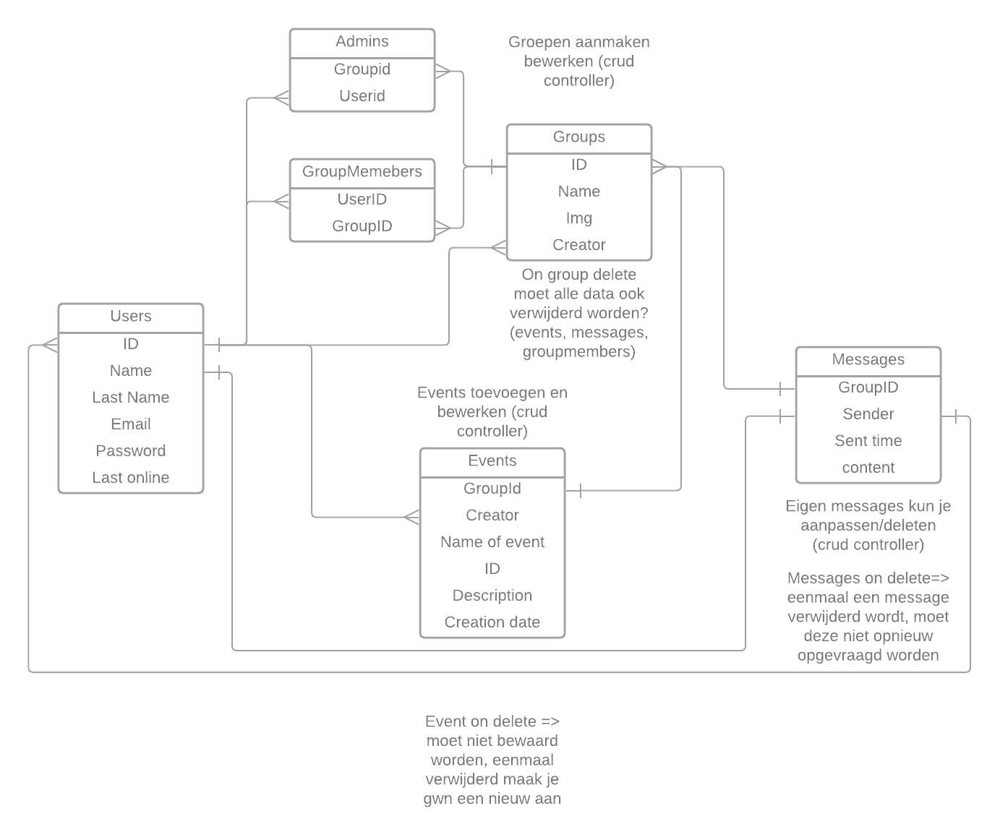
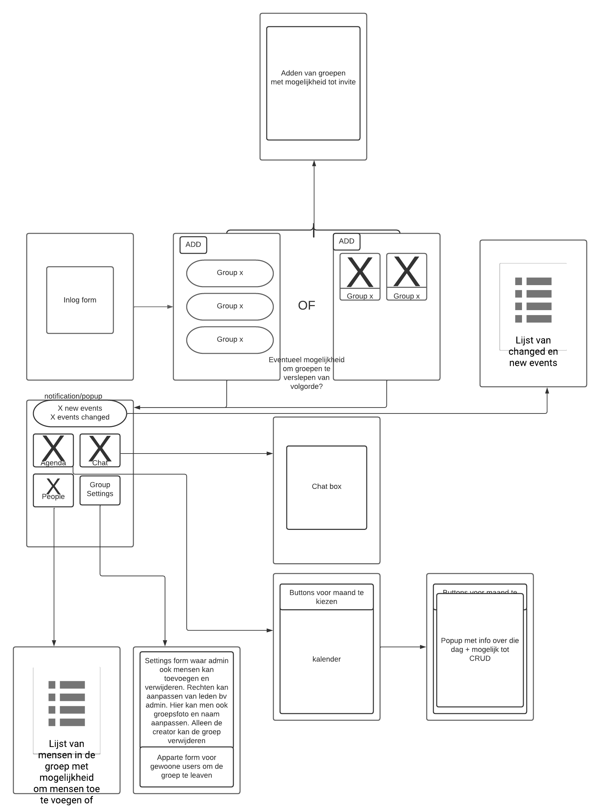

# Projectvoorstel Mobile Development Qiandro Claeys

## Online strategie

Kruis minstens **1 strategie** aan met

- [x] Online CRUD operaties met eigen REST API
- [ ] Online CRUD operaties met eenBackend Service
- [ ] Online Fetch, Offline CRUD
- [ ] Offline CRUD, Online Push
- [ ] Andere, namelijk: 

## Mobile features

Kruis minstens **2 mobile features** aan:

- [X] Xamarin Essentials => specifiek de file picker voor het uploaden van een groeps foto
- [x] Push notifications
- [ ] 2D Graphics
- [ ] Authentication en Authorization
- [ ] Native Communication
- [ ] Native Speech to Text
- [ ] Cross-platform Native Plugin
- [ ] Andere, namelijk: 

## Beschrijving

De gebruiker logt in op de applicatie en ziet een lijst van groepen waar hij toebehoord. 
Hier kan hij een nieuwe groep aanmaken of klikken op een groep.
Als je op een groep klikt kom je op de "home" screen van de groep terecht.

De "home" screen heeft 4 opties 

1. Kalender
2. Chatbox
3. People
4. Group settings

###  Kalender

In de kalender sectie kan men evenementen bekijken, toevoegen, editeren of verwijderen. Editeren en verwijderen gaat alleen bij evenementen die jezelf hebt aangemaakt tenzij je Admin bent dan kan je alles zelf editeren of verwijweren. 

### Chatbox
In de chatbox kan men berichten achterlaten. Berichten editeren en verwijderen kan je alleen voor jezelf.

### People
In de sectie People krijgt de gewoone gebruiker een lijst van mensen te zien die momenteel in de groep zitten. De admin kan hier mensen toevoegen en verwijdren en eventueel rechten aanpassen.

### Group settings
In de group settings kan men de groeps naam en/of foto aanpassen.

## Gebruikers
Allerlei soorten groepen kunnen dit gebruiken van een gewoone vriendengroep tot het in plannen van vergaderingen voor jeugdbeweging.

## ERD 

## Wireframes 

